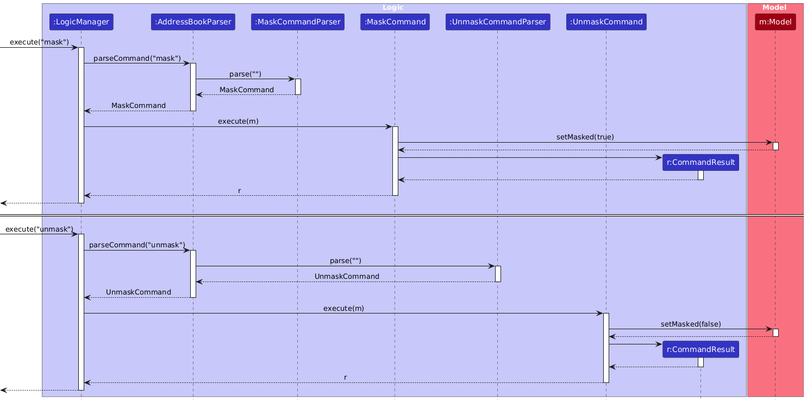

* Table of Contents
{:toc}

--------------------------------------------------------------------------------------------------------------------

## **Acknowledgements**

* This project is adapted from [AddressBook-Level3](https://se-education.org/addressbook-level3/), created by the [SE-EDU initiative](https://se-education.org/). Some architecture, documentation structure, and starter code were inherited from that codebase.
* The GUI is built with [JavaFX](https://openjfx.io/).
* JSON serialization and deserialization use [Jackson](https://github.com/FasterXML/jackson).
* Automated tests use [JUnit 5](https://junit.org/junit5/).
* Documentation diagrams were created with [PlantUML](https://plantuml.com/).
* The project website and documentation site are built with [Jekyll](https://jekyllrb.com/) and the [Minima](https://github.com/jekyll/minima) theme.

--------------------------------------------------------------------------------------------------------------------

## **Setting up, getting started**

Refer to the guide [_Setting up and getting started_](SettingUp.md).

--------------------------------------------------------------------------------------------------------------------

## **Design**

:bulb: **Tip:** The `.puml` files used to create diagrams are in the [`docs/diagrams`](https://github.com/AY2526S2-CS2103T-F10-2/tp/tree/master/docs/diagrams) folder. Refer to the [_PlantUML Tutorial_ at se-edu/guides](https://se-education.org/guides/tutorials/plantUml.html) to learn how to create and edit diagrams.

### Architecture

The ***Architecture Diagram*** given above explains the high-level design of the App.

Given below is a quick overview of main components and how they interact with each other.

**Main components of the architecture**

**`Main`** (consisting of classes [`Main`](https://github.com/AY2526S2-CS2103T-F10-2/tp/tree/master/src/main/java/cms/Main.java) and [`MainApp`](https://github.com/AY2526S2-CS2103T-F10-2/tp/tree/master/src/main/java/cms/MainApp.java)) is in charge of the app launch and shut down.
* At app launch, it initializes the other components in the correct sequence, and connects them up with each other.
* At shut down, it shuts down the other components and invokes cleanup methods where necessary.

The bulk of the app's work is done by the following four components:

* [**`UI`**](#ui-component): The UI of the App.
* [**`Logic`**](#logic-component): The command executor.
* [**`Model`**](#model-component): Holds the data of the App in memory.
* [**`Storage`**](#storage-component): Reads data from, and writes data to, the hard disk.

[**`Commons`**](#common-classes) represents a collection of classes used by multiple other components.

**How the architecture components interact with each other**

The *Sequence Diagram* below shows how the components interact with each other for the scenario where the user issues the command `delete id/1`.

Each of the four main components (also shown in the diagram above),

* defines its *API* in an `interface` with the same name as the Component.
* implements its functionality using a concrete `{Component Name}Manager` class (which follows the corresponding API `interface` mentioned in the previous point.

For example, the `Logic` component defines its API in the `Logic.java` interface and implements its functionality using the `LogicManager.java` class which follows the `Logic` interface. Other components interact with a given component through its interface rather than the concrete class (reason: to prevent outside component's being coupled to the implementation of a component), as illustrated in the (partial) class diagram below.

The sections below give more details of each component.

### UI component

The **API** of this component is specified in [`Ui.java`](https://github.com/AY2526S2-CS2103T-F10-2/tp/tree/master/src/main/java/cms/ui/Ui.java)

The UI consists of a `MainWindow` that is made up of parts e.g.`CommandBox`, `ResultDisplay`, `PersonListPanel`, `StatusBarFooter` etc. All these, including the `MainWindow`, inherit from the abstract `UiPart` class which captures the commonalities between classes that represent parts of the visible GUI.

The `UI` component uses the JavaFX UI framework. The layout of these UI parts are defined in matching `.fxml` files in the [`src/main/resources/view`](https://github.com/AY2526S2-CS2103T-F10-2/tp/tree/master/src/main/resources/view) folder. For example, the layout of the [`MainWindow`](https://github.com/AY2526S2-CS2103T-F10-2/tp/tree/master/src/main/java/cms/ui/MainWindow.java) is specified in [`MainWindow.fxml`](https://github.com/AY2526S2-CS2103T-F10-2/tp/tree/master/src/main/resources/view/MainWindow.fxml)

The `UI` component,

* executes user commands using the `Logic` component.
* listens for changes to `Model` data so that the UI can be updated with the modified data.
* keeps a reference to the `Logic` component, because the `UI` relies on the `Logic` to execute commands.
* depends on some classes in the `Model` component, as it displays `Person` object residing in the `Model`.

### Logic component

**API** : [`Logic.java`](https://github.com/AY2526S2-CS2103T-F10-2/tp/tree/master/src/main/java/cms/logic/Logic.java)

Here's a (partial) class diagram of the `Logic` component:

The sequence diagram below illustrates the interactions within the `Logic` component, taking `execute("delete id/1")` API call as an example.

:information_source: **Note:** The lifeline for `DeleteCommandParser` should end at the destroy marker (X) but due to a limitation of PlantUML, the lifeline continues till the end of diagram.

How the `Logic` component works:

1. When `Logic` is called upon to execute a command, it is passed to an `AddressBookParser` object which in turn creates a parser that matches the command (e.g., `DeleteCommandParser`) and uses it to parse the command.
1. This results in a `Command` object (more precisely, an object of one of its subclasses e.g., `DeleteCommand`) which is executed by the `LogicManager`.
1. The command can communicate with the `Model` when it is executed (e.g. to delete a person). 
   Note that although this is shown as a single step in the diagram above (for simplicity), in the code it can take several interactions (between the command object and the `Model`) to achieve.
1. The result of the command execution is encapsulated as a `CommandResult` object which is returned back from `Logic`.

Here are the other classes in `Logic` (omitted from the class diagram above) that are used for parsing a user command:

How the parsing works:
* When called upon to parse a user command, the `AddressBookParser` class creates an `XYZCommandParser` (`XYZ` is a placeholder for the specific command name e.g., `AddCommandParser`) which uses the other classes shown above to parse the user command and create a `XYZCommand` object (e.g., `AddCommand`) which the `AddressBookParser` returns back as a `Command` object.
* All `XYZCommandParser` classes (e.g., `AddCommandParser`, `DeleteCommandParser`, ...) inherit from the `Parser` interface so that they can be treated similarly where possible e.g, during testing.

### Model component
**API** : [`Model.java`](https://github.com/AY2526S2-CS2103T-F10-2/tp/tree/master/src/main/java/cms/model/Model.java)

The `Model` component,

* stores the CMS data, i.e. all `Person` objects, in a `UniquePersonList`.
* stores a _filtered_ list of `Person` objects (e.g. for `find` and `filter`) which is exposed to outsiders as an unmodifiable `ObservableList<Person>` so that the UI can update automatically when the displayed data changes.
* stores a `UserPrefs` object that represents the user's preferences. This is exposed to the outside as a `ReadOnlyUserPrefs` object.
* does not depend on any of the other three components, because the `Model` represents domain entities that should make sense on their own.

### Storage component

**API** : [`Storage.java`](https://github.com/AY2526S2-CS2103T-F10-2/tp/tree/master/src/main/java/cms/storage/Storage.java)

The `Storage` component,
* can save both CMS data and user preference data in JSON format, and read them back into corresponding objects.
* inherits from both `AddressBookStorage` and `UserPrefStorage`, which means it can be treated as either one (if only the functionality of only one is needed).
* depends on some classes in the `Model` component (because the `Storage` component's job is to save/retrieve objects that belong to the `Model`)

### Common classes

Classes used by multiple components are in the `cms.commons` package.

--------------------------------------------------------------------------------------------------------------------

## **Implementation**

This section describes the current CMS implementation at a high level. The command flow, component responsibilities, and diagrams above reflect the existing architecture and supported command-based workflow.

### Masking sensitive fields

**Implementation**

The masking feature lets course coordinators hide sensitive fields in the UI without changing the underlying `Person` data.
Instead of rewriting stored records, CMS keeps a single masking preference in `UserPrefs` and routes it through the `Model` interface.

The `mask` command works as follows:

1. `LogicManager` receives the user input and forwards it to `AddressBookParser`.
2. `AddressBookParser` creates `MaskCommandParser`, which returns a `MaskCommand`.
3. `MaskCommand#execute(Model)` calls `Model#setMasked(true)`.
4. `ModelManager` updates the `isMasked` flag stored in `UserPrefs`.
5. After command execution succeeds, `MainWindow#refreshPersonListPanel(...)` rebuilds the list and detail panels using `logic.isMasked()`.
6. `PersonCard` and `PersonDetailPanel` use `MaskingUtil` to render masked values while the underlying `Person` objects remain unchanged.

The following sequence diagram shows the flow for `mask` and `unmask`:

`unmask` follows the same flow, except that `UnmaskCommand#execute(Model)` calls `Model#setMasked(false)`.

Because the masking state is stored in `UserPrefs`, it is restored on startup and saved when preferences are written on normal shutdown.

#### Design considerations

**Aspect: Where to store masking state**

* **Alternative 1 (current choice):** Store the masking flag in `UserPrefs` and expose it through `Model`.
  * Pros: Keeps a single source of truth for both commands and UI, and allows the preference to persist across sessions.
  * Cons: Since masking does not modify any `Person` objects, the UI must explicitly refresh after the command to repaint masked values.

* **Alternative 2:** Store the masking state only inside UI classes.
  * Pros: Keeps the feature local to presentation code.
  * Cons: The list panel and detail panel would need separate coordination, and the preference would not naturally persist across restarts.

### Import and export features

**Implementation**

The import and export features let course coordinators move CMS data between the in-memory model and external JSON files without bypassing the existing storage and validation pipeline.
Instead of introducing a separate file format or duplicate serialization path, CMS reuses the storage layer so that manual command input and imported data are validated consistently.

The `import` and `export` commands work as follows:

1. `LogicManager` receives the user input and forwards it to `AddressBookParser`.
2. `AddressBookParser` creates either `ImportCommandParser` or `ExportCommandParser`.
3. `ImportCommandParser` or `ExportCommandParser` validates that the file path is wrapped in double quotes and ends with `.json`.
4. For `import`, `ImportCommandParser` also extracts the optional keep policy token (`keep/current` or `keep/incoming`), and `ImportCommand#execute` rejects the command with usage guidance if current data is non-empty and no keep policy is given.
5. `ImportCommand#execute(Model, Storage)` asks the storage layer to read and deserialize the target JSON file into model-compatible records.
6. Imported persons are merged into the model according to the selected keep policy, with conflicts resolved in favor of either the current record or the incoming record.
7. `ExportCommand#execute(Model, Storage)` asks the storage layer to serialize the current model state and write it to the target JSON file.

Import reports invalid file paths, unsupported file extensions, invalid JSON content, and malformed records as command errors.
Export reports invalid file paths, unsupported file extensions, and write failures as command errors.
Existing files are overwritten during export.

### NUS matriculation number validation

**Implementation**

NUS matriculation number validation ensures that CMS accepts only canonical NUS-style identifiers with valid check digits, preventing malformed or mistyped identifiers from entering the model.
Instead of scattering validation rules across parsers and storage classes, CMS centralises the logic in `NusMatric` so that all entry points enforce the same format and checksum rules.

Validation through command parsing works as follows:

1. A command parser such as `AddCommandParser`, `EditCommandParser`, `DeleteCommandParser`, `FindCommandParser`, or `TagCommandParser` delegates matric parsing to `ParserUtil#parseNusMatric(...)` or `ParserUtil#parseNusMatrics(...)`.
2. `ParserUtil` trims the raw input and calls `NusMatric#getValidationErrorMessage(...)`.
3. `NusMatric` canonicalises the input by trimming surrounding whitespace and converting it to uppercase.
4. `NusMatric` validates the canonical form against the accepted patterns `A#######X` and `U######X`, where `#` is a digit and `X` is a letter.
5. If the format is valid, `NusMatric` computes the expected check digit using the numeric portion of the matric number, prefix-specific weights, modulo 13, and a fixed check-digit lookup table.
6. If the computed check digit matches the provided trailing letter, `ParserUtil` constructs a `NusMatric` object; otherwise, parsing fails with a checksum-specific error message.

Validation during JSON import follows a separate entry path.
`JsonAdaptedPerson#toModelType()` calls `NusMatric#getValidationErrorMessage(...)` before constructing the imported `NusMatric` object, so imported records and interactive command input follow the same format, canonicalisation, and checksum rules.

Because validation is performed before model objects are created, malformed or checksum-invalid matric numbers are rejected early and never enter the address book state.
The implementation also canonicalises accepted values into uppercase form, which ensures consistent storage, comparison, and duplicate detection.

--------------------------------------------------------------------------------------------------------------------

## **Documentation, logging, testing, configuration, dev-ops**

* [Documentation guide](Documentation.md)
* [Testing guide](Testing.md)
* [Logging guide](Logging.md)
* [Configuration guide](Configuration.md)
* [DevOps guide](DevOps.md)

--------------------------------------------------------------------------------------------------------------------

## **Appendix: Requirements**

Given below are the requirements of Course Management System.

### Product scope

**Target user profile**:

* CS2103T course coordinator who manages 500+ students and a tutor team
* works mainly on a desktop workstation with a large monitor
* is extremely time-pressured and prefers high-efficiency workflows
* is a keyboard-first user who types very quickly
* prefers batch operations over repetitive manual tasks
* is comfortable using CLI-style tools, while appreciating a lightweight GUI for visibility

**Value proposition**: manage course logistics (students, tutors, groups) through fast, keyboard-driven commands

### User stories

Priorities: High (must have) - `* * *`, Medium (nice to have) - `* *`, Low (unlikely to have) - `*`

| Priority | As a …​                                    | I want to …​                     | So that …​                                                        |
| -------- | --------------------- | --------------------------------------------------------- | ---------------------------------------------------------------------- |
| `* * *`  | new user              | access a command summary or help guide                     | recall the command syntax without leaving the app                      |
| `* * *`  | course coordinator    | add a new student or tutor to the system                   | I can populate the course roster for the new semester                  |
| `* * *`  | course coordinator    | view a list of all users                                   | I can get an overview of the entire cohort and staff                   |
| `* * *`  | course coordinator    | delete a user from the system                              | students who drop the course do not clutter the database               |
| `* *`    | course coordinator    | bulk import student data from external files (CSV/Excel)    | I don't have to manually type in 500 student records                   |
| `* *`    | course coordinator    | manage over 500 student records                             | the system remains usable for the entire CS2103T cohort                |
| `* *`    | course coordinator    | edit an existing user's details (address/contact/tag)       | the contact information and tagging remain accurate throughout the semester |
| `* *`    | course coordinator    | filter for students who are not assigned to a group         | I can ensure no student is left behind before tutorials start          |
| `* *`    | course coordinator    | assign students to specific tutorial groups                 | the teams are balanced and logistics are settled                       |
| `* *`    | course coordinator    | create new tutor groups                                     | I can allocate resources for the incoming cohort                       |
| `* *`    | course coordinator    | view a summary of a student's progress                      | I can identify who is falling behind                                   |
| `* *`    | course coordinator    | automatically flag students who have late submissions        | I can apply penalties or offer assistance without manually checking timestamps |
| `* *`    | course coordinator    | mask sensitive student data (like emails/phones)            | I can limit the amount of information shared to others (without violating privacy) |
| `* *`    | course coordinator    | receive validation warnings when entering student data       | I do not accidentally save invalid email formats or duplicate IDs      |
| `* *`    | course coordinator    | view and add course details                                  | all necessary administrative information is central to the system      |
| `* *`    | course coordinator    | edit existing course details                                 | I can update website links or venue changes immediately                |
| `* *`    | course coordinator    | delete a course or its specific details                      | I can remove obsolete data from previous years                         |
| `* *`    | busy coordinator      | set system reminders for upcoming deadlines                  | I can send announcements to students on time                           |
| `* *`    | course coordinator    | view the overall completion status of an assessment           | I know how much of the cohort has submitted their work                 |
| `* *`    | power user            | create short aliases for long commands                        | I can execute complex tasks with just a few keystrokes                 |
| `* *`    | fast typist           | utilize auto-completion for commands and names                | I can input data faster and reduce spelling errors                     |
| `* *`    | course coordinator    | edit multiple records simultaneously (batch edit)             | I don't waste time making the same change to 50 different students one by one |
| `* *`    | course coordinator    | view a log of recent data changes                             | I can track what modifications I or the tutors have made               |
| `* *`    | course coordinator    | search for any name or course instantly                       | I can find specific records without scrolling through long lists       |
| `* *`    | course coordinator    | sort lists by name or tag                                     | the data is presented in the most useful order for my current task     |
| `* *`    | course coordinator    | see specific - actionable error messages                       | I can fix my input immediately without guessing what went wrong        |
| `* *`    | course coordinator    | export the current roster                                     | I can upload the data to the official university grading system        |
| `* *`    | course coordinator    | save the current state of the database to a specific file      | I have a portable copy of the data                                     |
| `* *`    | course coordinator    | choose how to handle duplicate entries during import           | I can update existing records without creating clones                  |
| `* *`    | course coordinator    | trigger emails to a filtered list of students                  | I can send targeted announcements quickly                              |
| `* *`    | course coordinator    | access a command summary or help guide                         | I can refresh my memory on syntax without leaving the app              |
| `* *`    | course coordinator    | access a settings menu                                         | I can configure the application behavior to my liking                  |
| `* *`    | late-night user       | toggle between dark and light modes                            | I can reduce eye strain                                                |
| `* *`    | course coordinator    | adjust the text size                                           | the interface remains readable on different monitors                   |
| `* *`    | course coordinator    | experience instant feedback (<100ms) even under load           | my fast workflow is not interrupted by loading screens                 |
| `*`      | course coordinator    | view a specific user's profile                                 | I can quickly access their contact details, SOC ID and GitHub ID when needed |
| `*`      | course coordinator    | initialize a new course container                               | I can begin setting up a new iteration of CS2103T                      |
| `*`      | course coordinator    | add new assessment items                                       | the grading structure is defined for the semester                      |
| `*`      | course coordinator    | set deadlines for assessments                                  | the system can track lateness automatically                            |
| `*`      | keyboard-first user   | use custom keybindings for common actions                      | I can navigate the app without slowing down to use the mouse           |
| `*`      | fast working user     | undo my last command                                           | I can instantly rectify mistakes without re-entering data              |
| `*`      | power user            | use SQL-like syntax to query the data                          | I can perform complex filtering operations that standard buttons don't support |
| `*`      | course coordinator    | generate a formatted PDF/Text report                           | I can share course statistics with the faculty                         |
| `*`      | course coordinator    | load data from a specific file                                 | I can switch between different semesters or backup versions            |
| `*`      | course coordinator    | configure automatic backups                                    | I do not lose critical course data in the event of a crash             |
| `*`      | course coordinator    | apply different visual themes                                  | the environment feels personalized and pleasant to use                 |

### Use cases

(For all use cases below, the **System** is the `Course Management System` and the **Actor** is the `course coordinator`, unless specified otherwise)

**Use case: Assign a student to a tutorial group**

**MSS**

1.  Course coordinator requests to list all persons
2.  Course Management System shows all persons
3.  Course coordinator requests to update a student's tutorial group
4.  Course Management System updates the student's tutorial group

      Use case ends.

**Extensions**

* 2a. There are no students in the system.

   Use case ends.

* 3a. The specified tutorial group is invalid.

   * 3a1. Course Management System shows an error message.
   * 3a2. Course coordinator retries with a valid tutorial group.

      Use case resumes at step 3.

**Use case: Import records from JSON**

**MSS**

1.  Course coordinator requests to import data and provides a JSON file path
2.  Course Management System parses the file and validates the records
3.  Course Management System imports the records and shows a completion summary

    Use case ends.

**Extensions**

* 2a. The file cannot be read (missing, corrupted, invalid path, or unsupported extension).

   * 2a1. Course Management System shows an error message describing the issue.

      Use case ends.

* 2b. Existing data is non-empty and no keep policy is provided.

   * 2b1. Course Management System rejects the command and asks for `keep/current` or `keep/incoming`.
   * 2b2. Course coordinator retries the import with a keep policy.

      Use case resumes at step 1.

* 2c. Some records contain invalid data.

   * 2c1. Course Management System shows an error message.
   * 2c2. Course coordinator fixes the source file and retries the import.

      Use case resumes at step 1.

### Non-Functional Requirements

1.  Should work on any _mainstream OS_ as long as it has Java `17` or above installed.
2.  Should be able to manage at least 500 student records (and associated tutors, groups, and courses) without a noticeable sluggishness in performance for typical usage.
3.  For common operations (e.g., add, search, filter, list, edit), the system should provide instant feedback (target: under 100ms) for a dataset size of 500 students.
4.  A user with above average typing speed for regular English text (i.e. not code, not system admin commands) should be able to accomplish most of the tasks faster using commands than using the mouse.
5.  Should provide clear, actionable validation and error messages that help users recover quickly.

### Glossary

* **Mainstream OS**: Windows, Linux, Unix, MacOS
* **Tutorial group**: A tutor-led subgroup of students for administrative and teaching allocation purposes.
* **Sensitive student data**: Private fields such as phone numbers that may need masking.

--------------------------------------------------------------------------------------------------------------------

## **Appendix: Instructions for manual testing**

Given below are instructions to test the app manually.

:information_source: **Note:** These instructions only provide a starting point for testers to work on;
testers are expected to do more *exploratory* testing.

### Launch and shutdown

1. Initial launch

   1. Download the jar file and copy into an empty folder

   1. Double-click the jar file Expected: Shows the GUI with a set of sample contacts. The window size may not be optimum.

1. Saving window preferences

   1. Resize the window to an optimum size. Move the window to a different location. Close the window.

   1. Re-launch the app by double-clicking the jar file. 
       Expected: The most recent window size and location is retained.

### Adding a student / tutor

1. Adding a person while all persons are being shown

   1. Prerequisites: List all persons using the `list` command. Multiple persons in the list.

   1. Test case: `add n/John Doe m/A0234567X role/student soc/johnd gh/john-gh p/91234567 e/john@example.com t/01` 
      Expected: New contact is added to the list. Details of the added contact shown in the status message.

   1. Test case: Repeat the same `add` command above a second time. 
      Expected: If a person with the same NUS Matric / SoC username / GitHub username / email already exists,
      the app shows an error message indicating a duplicate unique field. No person is added.

   1. Incorrect add command to try: `add` 
      Expected: Validation errors are shown describing the missing required fields or incorrect format.

### Deleting a person

1. Deleting a person while all persons are being shown

   1. Prerequisites: List all persons using the `list` command. Multiple persons in the list.

   1. Test case: `delete id/1 3` 
      Expected: The first and third shown contacts are deleted in one command.

   1. Test case: `delete m/A0123456J` 
      Expected: The person with NUS Matric `A0123456J` is deleted.

   1. Incorrect delete command to try: `delete m/A9999999Z` 
      Expected: Error messages are shown describing the invalid command format or invalid target person(s).

### Finding persons

1. Finding persons by supported prefixes

   1. Prerequisites: List all persons using the `list` command. Use the sample data shown on first launch.

   1. Test case: `find n/Elle` 
      Expected: Only `Elle Meyer` remains in the shown list.

   1. Test case: `find m/A0234502U A0234505M` 
      Expected: Only the persons with NUS Matrics `A0234502U` and `A0234505M` remain in the shown list.

   1. Test case: `find a/friends` 
      Expected: Only persons whose fields contain `friends` remain in the shown list, including persons tagged `friends`.

   1. Test case: `find n/Elle m/A0234505M` 
      Expected: Matches are combined with OR, so both `Elle Meyer` and the person with NUS Matric `A0234505M` remain.

   1. Test case: `find n/NoSuchPerson` 
      Expected: The shown list becomes empty and the result display reports `0 persons listed!`

   1. Incorrect command to try: `find Elle` 
      Expected: Command is rejected because at least one supported prefix (`a/`, `n/`, or `m/`) is required.

### Tagging persons

1. Adding and removing tags

   1. Prerequisites: `list` has at least two persons.

   1. Test case: `tag add id/1 2 tag/mentor` 
      Expected: Tag `mentor` is added to both target persons.

   1. Test case: `tag delete id/1 tag/mentor` 
      Expected: Tag `mentor` is removed from person 1.

   1. Incorrect command to try: `tag add id/1 m/A0234501W tag/mentor` 
      Expected: Command is rejected because index and matric targeting cannot be mixed.

### Filtering persons

1. Filtering by tag/tutorial group

   1. Prerequisites: Add tags/tutorial groups so some people match and some do not.

   1. Test case: `filter tag/mentor t/01` 
      Expected: Only persons that have tag `mentor` and tutorial group `01` remain in the shown list.

   1. Incorrect command to try: `filter` 
      Expected: Command is rejected because at least one filter must be provided.

### Sorting persons

1. Sorting by supported keys

   1. Test case: `sort name` 
      Expected: Persons are sorted by name.

   1. Test case: `sort tg` 
      Expected: Persons are sorted by tutorial group.

   1. Test case: `sort NAME` 
      Expected: Persons are still sorted by name because the sort key is case-insensitive.

   1. Incorrect command to try: `sort tag` 
      Expected: Command is rejected with usage guidance.

### Masking and unmasking

1. Toggle display masking

   1. Test case: `mask` 
      Expected: Sensitive fields (NUS Matric, SoC username, GitHub username, email, phone) are masked in list/detail panels.

   1. Test case: `unmask` 
      Expected: Sensitive fields are shown again.

### Clearing all records

1. Clearing the address book with confirmation

   1. Prerequisites: CMS contains at least one person.

   1. Test case: `clear` 
      Expected: No records are deleted. CMS shows a reminder to run `clear confirm/yes`.

   1. Test case: `clear confirm/yes` 
      Expected: All records are deleted and the shown list becomes empty.

   1. Incorrect command to try: `clear foo` 
      Expected: Command is rejected with usage guidance.

### Exporting and importing JSON data

1. Export current data

   1. Test case: `export "data/manual-test-export.json"` 
      Expected: Command succeeds and creates/overwrites `data/manual-test-export.json`.

   1. Incorrect command to try: `export "data/manual-test-export.txt"` 
      Expected: Command is rejected because file path must end with `.json`.

1. Import data with and without keep policy

   1. Prerequisites: Use the exported file from the previous test.

   1. Test case: `import "data/manual-test-export.json"` (when current data is non-empty) 
      Expected: Command is rejected and asks for `keep/current` or `keep/incoming`.

   1. Test case: `import "data/manual-test-export.json" keep/current` 
      Expected: Command succeeds and keeps existing records where conflicts occur.

   1. Test case: `import "data/manual-test-export.json" keep/incoming` 
      Expected: Command succeeds and incoming records replace existing conflicting records.

   1. Incorrect command to try: `import "data/manual-test-export.txt"` 
      Expected: Command is rejected because file path must end with `.json`.
