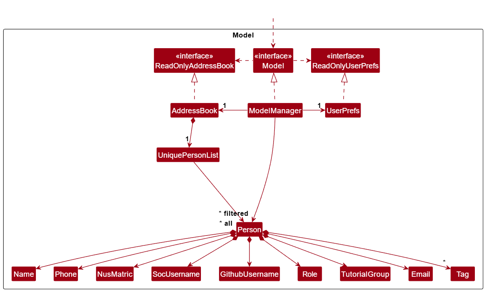

* Table of Contents
{:toc}

--------------------------------------------------------------------------------------------------------------------

## **Acknowledgements**

* {list here sources of all reused/adapted ideas, code, documentation, and third-party libraries -- include links to the original source as well}

--------------------------------------------------------------------------------------------------------------------

## **Setting up, getting started**

Refer to the guide [_Setting up and getting started_](SettingUp.md).

--------------------------------------------------------------------------------------------------------------------

## **Design**

:bulb: **Tip:** The `.puml` files used to create diagrams are in this document `docs/diagrams` folder. Refer to the [_PlantUML Tutorial_ at se-edu/guides](https://se-education.org/guides/tutorials/plantUml.html) to learn how to create and edit diagrams.

### Architecture

The ***Architecture Diagram*** given above explains the high-level design of the App.

Given below is a quick overview of main components and how they interact with each other.

**Main components of the architecture**

**`Main`** (consisting of classes [`Main`](https://github.com/se-edu/addressbook-level3/tree/master/src/main/java/seedu/address/Main.java) and [`MainApp`](https://github.com/se-edu/addressbook-level3/tree/master/src/main/java/seedu/address/MainApp.java)) is in charge of the app launch and shut down.
* At app launch, it initializes the other components in the correct sequence, and connects them up with each other.
* At shut down, it shuts down the other components and invokes cleanup methods where necessary.

The bulk of the app's work is done by the following four components:

* [**`UI`**](#ui-component): The UI of the App.
* [**`Logic`**](#logic-component): The command executor.
* [**`Model`**](#model-component): Holds the data of the App in memory.
* [**`Storage`**](#storage-component): Reads data from, and writes data to, the hard disk.

[**`Commons`**](#common-classes) represents a collection of classes used by multiple other components.

**How the architecture components interact with each other**

The *Sequence Diagram* below shows how the components interact with each other for the scenario where the user issues the command `delete 1`.

Each of the four main components (also shown in the diagram above),

* defines its *API* in an `interface` with the same name as the Component.
* implements its functionality using a concrete `{Component Name}Manager` class (which follows the corresponding API `interface` mentioned in the previous point.

For example, the `Logic` component defines its API in the `Logic.java` interface and implements its functionality using the `LogicManager.java` class which follows the `Logic` interface. Other components interact with a given component through its interface rather than the concrete class (reason: to prevent outside component's being coupled to the implementation of a component), as illustrated in the (partial) class diagram below.

The sections below give more details of each component.

### UI component

The **API** of this component is specified in [`Ui.java`](https://github.com/se-edu/addressbook-level3/tree/master/src/main/java/seedu/address/ui/Ui.java)

The UI consists of a `MainWindow` that is made up of parts e.g.`CommandBox`, `ResultDisplay`, `PersonListPanel`, `StatusBarFooter` etc. All these, including the `MainWindow`, inherit from the abstract `UiPart` class which captures the commonalities between classes that represent parts of the visible GUI.

The `UI` component uses the JavaFx UI framework. The layout of these UI parts are defined in matching `.fxml` files that are in the `src/main/resources/view` folder. For example, the layout of the [`MainWindow`](https://github.com/se-edu/addressbook-level3/tree/master/src/main/java/seedu/address/ui/MainWindow.java) is specified in [`MainWindow.fxml`](https://github.com/se-edu/addressbook-level3/tree/master/src/main/resources/view/MainWindow.fxml)

The `UI` component,

* executes user commands using the `Logic` component.
* listens for changes to `Model` data so that the UI can be updated with the modified data.
* keeps a reference to the `Logic` component, because the `UI` relies on the `Logic` to execute commands.
* depends on some classes in the `Model` component, as it displays `Person` object residing in the `Model`.

### Logic component

**API** : [`Logic.java`](https://github.com/se-edu/addressbook-level3/tree/master/src/main/java/seedu/address/logic/Logic.java)

Here's a (partial) class diagram of the `Logic` component:

The sequence diagram below illustrates the interactions within the `Logic` component, taking `execute("delete 1")` API call as an example.

:information_source: **Note:** The lifeline for `DeleteCommandParser` should end at the destroy marker (X) but due to a limitation of PlantUML, the lifeline continues till the end of diagram.

How the `Logic` component works:

1. When `Logic` is called upon to execute a command, it is passed to an `AddressBookParser` object which in turn creates a parser that matches the command (e.g., `DeleteCommandParser`) and uses it to parse the command.
1. This results in a `Command` object (more precisely, an object of one of its subclasses e.g., `DeleteCommand`) which is executed by the `LogicManager`.
1. The command can communicate with the `Model` when it is executed (e.g. to delete a person). 
   Note that although this is shown as a single step in the diagram above (for simplicity), in the code it can take several interactions (between the command object and the `Model`) to achieve.
1. The result of the command execution is encapsulated as a `CommandResult` object which is returned back from `Logic`.

Here are the other classes in `Logic` (omitted from the class diagram above) that are used for parsing a user command:

How the parsing works:
* When called upon to parse a user command, the `AddressBookParser` class creates an `XYZCommandParser` (`XYZ` is a placeholder for the specific command name e.g., `AddCommandParser`) which uses the other classes shown above to parse the user command and create a `XYZCommand` object (e.g., `AddCommand`) which the `AddressBookParser` returns back as a `Command` object.
* All `XYZCommandParser` classes (e.g., `AddCommandParser`, `DeleteCommandParser`, ...) inherit from the `Parser` interface so that they can be treated similarly where possible e.g, during testing.

### Model component
**API** : [`Model.java`](https://github.com/se-edu/addressbook-level3/tree/master/src/main/java/seedu/address/model/Model.java)

The `Model` component,

* stores the address book data i.e., all `Person` objects (which are contained in a `UniquePersonList` object).
* stores the currently 'selected' `Person` objects (e.g., results of a search query) as a separate _filtered_ list which is exposed to outsiders as an unmodifiable `ObservableList<Person>` that can be 'observed' e.g. the UI can be bound to this list so that the UI automatically updates when the data in the list change.
* stores a `UserPref` object that represents the user’s preferences. This is exposed to the outside as a `ReadOnlyUserPref` objects.
* does not depend on any of the other three components (as the `Model` represents data entities of the domain, they should make sense on their own without depending on other components)

### Storage component

**API** : [`Storage.java`](https://github.com/se-edu/addressbook-level3/tree/master/src/main/java/seedu/address/storage/Storage.java)

The `Storage` component,
* can save both address book data and user preference data in JSON format, and read them back into corresponding objects.
* inherits from both `AddressBookStorage` and `UserPrefStorage`, which means it can be treated as either one (if only the functionality of only one is needed).
* depends on some classes in the `Model` component (because the `Storage` component's job is to save/retrieve objects that belong to the `Model`)

### Common classes

Classes used by multiple components are in the `seedu.address.commons` package.

--------------------------------------------------------------------------------------------------------------------

## **Implementation**

This section describes some noteworthy details on how certain features are implemented.

### \[Proposed\] Undo/redo feature

#### Proposed Implementation

The proposed undo/redo mechanism is facilitated by `VersionedAddressBook`. It extends `AddressBook` with an undo/redo history, stored internally as an `addressBookStateList` and `currentStatePointer`. Additionally, it implements the following operations:

* `VersionedAddressBook#commit()` — Saves the current address book state in its history.
* `VersionedAddressBook#undo()` — Restores the previous address book state from its history.
* `VersionedAddressBook#redo()` — Restores a previously undone address book state from its history.

These operations are exposed in the `Model` interface as `Model#commitAddressBook()`, `Model#undoAddressBook()` and `Model#redoAddressBook()` respectively.

Given below is an example usage scenario and how the undo/redo mechanism behaves at each step.

Step 1. The user launches the application for the first time. The `VersionedAddressBook` will be initialized with the initial address book state, and the `currentStatePointer` pointing to that single address book state.

Step 2. The user executes `delete 5` command to delete the 5th person in the address book. The `delete` command calls `Model#commitAddressBook()`, causing the modified state of the address book after the `delete 5` command executes to be saved in the `addressBookStateList`, and the `currentStatePointer` is shifted to the newly inserted address book state.

Step 3. The user executes `add n/David …​` to add a new person. The `add` command also calls `Model#commitAddressBook()`, causing another modified address book state to be saved into the `addressBookStateList`.

:information_source: **Note:** If a command fails its execution, it will not call `Model#commitAddressBook()`, so the address book state will not be saved into the `addressBookStateList`.

Step 4. The user now decides that adding the person was a mistake, and decides to undo that action by executing the `undo` command. The `undo` command will call `Model#undoAddressBook()`, which will shift the `currentStatePointer` once to the left, pointing it to the previous address book state, and restores the address book to that state.

:information_source: **Note:** If the `currentStatePointer` is at index 0, pointing to the initial AddressBook state, then there are no previous AddressBook states to restore. The `undo` command uses `Model#canUndoAddressBook()` to check if this is the case. If so, it will return an error to the user rather
than attempting to perform the undo.

The following sequence diagram shows how an undo operation goes through the `Logic` component:

:information_source: **Note:** The lifeline for `UndoCommand` should end at the destroy marker (X) but due to a limitation of PlantUML, the lifeline reaches the end of diagram.

Similarly, how an undo operation goes through the `Model` component is shown below:

The `redo` command does the opposite — it calls `Model#redoAddressBook()`, which shifts the `currentStatePointer` once to the right, pointing to the previously undone state, and restores the address book to that state.

:information_source: **Note:** If the `currentStatePointer` is at index `addressBookStateList.size() - 1`, pointing to the latest address book state, then there are no undone AddressBook states to restore. The `redo` command uses `Model#canRedoAddressBook()` to check if this is the case. If so, it will return an error to the user rather than attempting to perform the redo.

Step 5. The user then decides to execute the command `list`. Commands that do not modify the address book, such as `list`, will usually not call `Model#commitAddressBook()`, `Model#undoAddressBook()` or `Model#redoAddressBook()`. Thus, the `addressBookStateList` remains unchanged.

Step 6. The user executes `clear`, which calls `Model#commitAddressBook()`. Since the `currentStatePointer` is not pointing at the end of the `addressBookStateList`, all address book states after the `currentStatePointer` will be purged. Reason: It no longer makes sense to redo the `add n/David …​` command. This is the behavior that most modern desktop applications follow.

The following activity diagram summarizes what happens when a user executes a new command:

#### Design considerations:

**Aspect: How undo & redo executes:**

* **Alternative 1 (current choice):** Saves the entire address book.
  * Pros: Easy to implement.
  * Cons: May have performance issues in terms of memory usage.

* **Alternative 2:** Individual command knows how to undo/redo by
  itself.
  * Pros: Will use less memory (e.g. for `delete`, just save the person being deleted).
  * Cons: We must ensure that the implementation of each individual command are correct.

_{more aspects and alternatives to be added}_

### \[Proposed\] Data archiving

_{Explain here how the data archiving feature will be implemented}_

--------------------------------------------------------------------------------------------------------------------

## **Documentation, logging, testing, configuration, dev-ops**

* [Documentation guide](Documentation.md)
* [Testing guide](Testing.md)
* [Logging guide](Logging.md)
* [Configuration guide](Configuration.md)
* [DevOps guide](DevOps.md)

--------------------------------------------------------------------------------------------------------------------

## **Appendix: Requirements**

### Product scope

**Target user profile**:

* CS2103T course coordinator who manages 500+ students and a tutor team
* works mainly on a desktop workstation with a large monitor
* is extremely time-pressured and prefers high-efficiency workflows
* is a keyboard-first user who types very quickly
* prefers batch operations over repetitive manual tasks
* is comfortable using CLI-style tools, while appreciating a lightweight GUI for visibility

**Value proposition**: manage course logistics (students, tutors, groups) through fast, keyboard-driven commands

### User stories

Priorities: High (must have) - `* * *`, Medium (nice to have) - `* *`, Low (unlikely to have) - `*`

| Priority | As a …​                                    | I want to …​                     | So that …​                                                        |
| -------- | --------------------- | --------------------------------------------------------- | ---------------------------------------------------------------------- |
| `* * *`  | new user              | access a command summary or help guide                     | recall the command syntax without leaving the app                      |
| `* * *`  | course coordinator    | add a new student or tutor to the system                   | I can populate the course roster for the new semester                  |
| `* * *`  | course coordinator    | view a list of all users                                   | I can get an overview of the entire cohort and staff                   |
| `* * *`  | course coordinator    | delete a user from the system                              | students who drop the course do not clutter the database               |
| `* *`    | course coordinator    | bulk import student data from external files (CSV/Excel)    | I don't have to manually type in 500 student records                   |
| `* *`    | course coordinator    | manage over 500 student records                             | the system remains usable for the entire CS2103T cohort                |
| `* *`    | course coordinator    | edit an existing user's details (address/contact/tag)       | the contact information and tagging remain accurate throughout the semester |
| `* *`    | course coordinator    | filter for students who are not assigned to a group         | I can ensure no student is left behind before tutorials start          |
| `* *`    | course coordinator    | assign students to specific tutorial groups                 | the teams are balanced and logistics are settled                       |
| `* *`    | course coordinator    | create new tutor groups                                     | I can allocate resources for the incoming cohort                       |
| `* *`    | course coordinator    | view a summary of a student's progress                      | I can identify who is falling behind                                   |
| `* *`    | course coordinator    | automatically flag students who have late submissions        | I can apply penalties or offer assistance without manually checking timestamps |
| `* *`    | course coordinator    | mask sensitive student data (like emails/phones)            | I can limit the amount of information shared to others (without violating privacy) |
| `* *`    | course coordinator    | receive validation warnings when entering student data       | I do not accidentally save invalid email formats or duplicate IDs      |
| `* *`    | course coordinator    | view and add course details                                  | all necessary administrative information is central to the system      |
| `* *`    | course coordinator    | edit existing course details                                 | I can update website links or venue changes immediately                |
| `* *`    | course coordinator    | delete a course or its specific details                      | I can remove obsolete data from previous years                         |
| `* *`    | busy coordinator      | set system reminders for upcoming deadlines                  | I can send announcements to students on time                           |
| `* *`    | course coordinator    | view the overall completion status of an assessment           | I know how much of the cohort has submitted their work                 |
| `* *`    | power user            | create short aliases for long commands                        | I can execute complex tasks with just a few keystrokes                 |
| `* *`    | fast typist           | utilize auto-completion for commands and names                | I can input data faster and reduce spelling errors                     |
| `* *`    | course coordinator    | edit multiple records simultaneously (batch edit)             | I don't waste time making the same change to 50 different students one by one |
| `* *`    | course coordinator    | view a log of recent data changes                             | I can track what modifications I or the tutors have made               |
| `* *`    | course coordinator    | search for any name or course instantly                       | I can find specific records without scrolling through long lists       |
| `* *`    | course coordinator    | sort lists by name or tag                                     | the data is presented in the most useful order for my current task     |
| `* *`    | course coordinator    | see specific - actionable error messages                       | I can fix my input immediately without guessing what went wrong        |
| `* *`    | course coordinator    | export the current roster                                     | I can upload the data to the official university grading system        |
| `* *`    | course coordinator    | save the current state of the database to a specific file      | I have a portable copy of the data                                     |
| `* *`    | course coordinator    | choose how to handle duplicate entries during import           | I can update existing records without creating clones                  |
| `* *`    | course coordinator    | trigger emails to a filtered list of students                  | I can send targeted announcements quickly                              |
| `* *`    | course coordinator    | access a command summary or help guide                         | I can refresh my memory on syntax without leaving the app              |
| `* *`    | course coordinator    | access a settings menu                                         | I can configure the application behavior to my liking                  |
| `* *`    | late-night user       | toggle between dark and light modes                            | I can reduce eye strain                                                |
| `* *`    | course coordinator    | adjust the text size                                           | the interface remains readable on different monitors                   |
| `* *`    | course coordinator    | experience instant feedback (<100ms) even under load           | my fast workflow is not interrupted by loading screens                 |
| `*`      | course coordinator    | view a specific user's profile                                 | I can quickly access their contact details, SOC ID and GitHub ID when needed |
| `*`      | course coordinator    | initialize a new course container                               | I can begin setting up a new iteration of CS2103T                      |
| `*`      | course coordinator    | add new assessment items                                       | the grading structure is defined for the semester                      |
| `*`      | course coordinator    | set deadlines for assessments                                  | the system can track lateness automatically                            |
| `*`      | keyboard-first user   | use custom keybindings for common actions                      | I can navigate the app without slowing down to use the mouse           |
| `*`      | fast working user     | undo my last command                                           | I can instantly rectify mistakes without re-entering data              |
| `*`      | power user            | use SQL-like syntax to query the data                          | I can perform complex filtering operations that standard buttons don't support |
| `*`      | course coordinator    | generate a formatted PDF/Text report                           | I can share course statistics with the faculty                         |
| `*`      | course coordinator    | load data from a specific file                                 | I can switch between different semesters or backup versions            |
| `*`      | course coordinator    | configure automatic backups                                    | I do not lose critical course data in the event of a crash             |
| `*`      | course coordinator    | apply different visual themes                                  | the environment feels personalized and pleasant to use                 |

### Use cases

(For all use cases below, the **System** is the `Course Management System` and the **Actor** is the `course coordinator`, unless specified otherwise)

**Use case: Assign a student to a tutorial group**

**MSS**

1.  Course coordinator requests to list students who are not assigned to any tutorial group
2.  Course Management System shows the filtered list of unassigned students
3.  Course coordinator selects a student and requests to assign the student to a specified tutorial group
4.  Course Management System assigns the student

      Use case ends.

**Extensions**

* 2a. There are no unassigned students.

   Use case ends.

* 3a. The specified tutorial group does not exist.

   * 3a1. Course Management System shows an error message.
   * 3a2. Course coordinator creates the tutorial group.
   * 3a3. Course coordinator retries the assignment.

      Use case resumes at step 3.

**Use case: Import a student roster from CSV/Excel**

**MSS**

1.  Course coordinator requests to import roster data and provides a file path
2.  Course Management System parses the file and validates the records
3.  Course Management System shows a preview summary (e.g., number of records, warnings, duplicates)
4.  Course Management System imports the records and shows a completion summary

    Use case ends.

**Extensions**

* 2a. The file cannot be read (missing, corrupted, unsupported format).

   * 2a1. Course Management System shows an error message describing the issue.

      Use case ends.

* 2b. Some records contain invalid data.

   * 2b1. Course Management System shows validation warnings and which rows/fields are problematic.
   * 2b2. Course coordinator fixes the source file and retries the import.

      Use case resumes at step 1.

### Non-Functional Requirements

1.  Should work on any _mainstream OS_ as long as it has Java `17` or above installed.
2.  Should be able to manage at least 500 student records (and associated tutors, groups, and courses) without a noticeable sluggishness in performance for typical usage.
3.  For common operations (e.g., search, filter, list, assign, edit), the system should provide instant feedback (target: under 100ms) for a dataset size of 500 students.
4.  A user with above average typing speed for regular English text (i.e. not code, not system admin commands) should be able to accomplish most of the tasks faster using commands than using the mouse.
5.  Should provide clear, actionable validation and error messages that help users recover quickly.

### Glossary

* **Mainstream OS**: Windows, Linux, Unix, MacOS
* **Tutorial group**: A tutor-led subgroup of students for administrative and teaching allocation purposes.
* **Sensitive student data**: Private fields such as phone numbers that may need masking.

--------------------------------------------------------------------------------------------------------------------

## **Appendix: Instructions for manual testing**

Given below are instructions to test the app manually.

:information_source: **Note:** These instructions only provide a starting point for testers to work on;
testers are expected to do more *exploratory* testing.

### Launch and shutdown

1. Initial launch

   1. Download the jar file and copy into an empty folder

   1. Double-click the jar file Expected: Shows the GUI with a set of sample contacts. The window size may not be optimum.

1. Saving window preferences

   1. Resize the window to an optimum size. Move the window to a different location. Close the window.

   1. Re-launch the app by double-clicking the jar file. 
       Expected: The most recent window size and location is retained.

### Adding a student / tutor

1. Adding a person while all persons are being shown

   1. Prerequisites: List all persons using the `list` command. Multiple persons in the list.

   1. Test case: `add n/John Doe m/A0123456X role/student soc/johnd gh/john-gh p/91234567
      e/john@example.com t/T01` 
      Expected: New contact is added to the list. Details of the added contact shown in the status message.

   1. Test case: `add n/David Tan m/A0211111C role/student soc/david1 gh/davidtan99
      e/david@u.nus.edu p/97654321 t/T05` twice 
      Expected: If a person with the same NUS Matric / SoC username / GitHub username / email already exists,
      the app shows an error message indicating
      a duplicate NUS Matric. No person is added. Status bar remains the same.

   1. Other incorrect add commands to try: `add`, `add n/` 
      Expected: Validation errors are shown describing the missing required fields or incorrect format.

### Deleting a person

1. Deleting a person while all persons are being shown

   1. Prerequisites: List all persons using the `list` command. Multiple persons in the list.

   1. Test case: `delete 1` 
      Expected: First contact is deleted from the list. Details of the deleted contact shown in the status message.

   1. Test case: `delete 1 3` 
      Expected: First and third contacts are deleted from the list. Details of the deleted contacts shown in the status message.

   1. Test case: `delete m/A0000001B` 
      Expected: The contact with NUS Matric `A0000001B` is deleted from the list. Details of the deleted contact shown in the status message.

   1. Test case: `delete m/A0000001B A0000003D` 
      Expected: The contacts with NUS Matrics `A0000001B` and `A0000003D` are deleted from the list. Details of the deleted contacts shown in the status message.

   1. Test case: `delete 1 1` 
      Expected: First contact is deleted only once. Details of the deleted contact shown in the status message.

   1. Test case: `delete m/A0000001B A0000001B` 
      Expected: The contact with NUS Matric `A0000001B` is deleted only once. Details of the deleted contact shown in the status message.

   1. Other incorrect delete commands to try: `delete`, `delete 0`, `delete x`, `delete 999`, `delete m/A9999999Z` 
      Expected: Error messages are shown describing the invalid command format or invalid target person(s).
